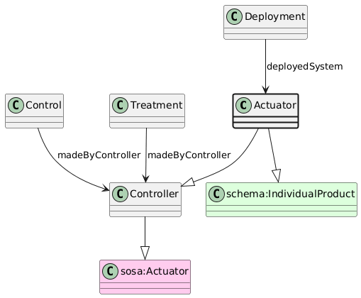

# Actuator
[https://schema.plantphenomics.org.au/Actuator](https://schema.plantphenomics.org.au/Actuator)

An electromechanical device that can control the value for a ControlledVariable and that may be mounted on a Platform. Note that SOSA maps electromechanical components to prov:Agent, but CDIF recommendation is that Agent should be an intentional role. An Actuator is also an ObservationUnit so that it may be the target for Control Assays (setting device parameters as ControlledVariables) and potentially for Observation Assays (reading device state as ObservedVariables).

## Superclasses
* [https://schema.plantphenomics.org.au/Controller](appn_Controller.md)
* https://www.w3.org/ns/sosa/Actuator
* [https://schema.plantphenomics.org.au/ObservationUnit](appn_ObservationUnit.md)
* https://schema.org/Thing
* http://www.w3.org/ns/prov#Entity
* http://purl.org/ppeo/PPEO.owl#observation_unit
* https://www.w3.org/ns/sosa/FeatureOfInterest
* https://schema.org/IndividualProduct
## Properties
* [appn:Deployment](appn_Deployment.md) **appn:deployedSystem** appn:Actuator
    * Identifies a Sensor or Actuator deployed on a Platform.
* [appn:Control](appn_Control.md) **appn:madeByController** [appn:Controller](appn_Controller.md)
    * Identifies the entity (Controller, i.e. one of a Person, Actuator, SoftwareApplication or ExternalEvent) responsible for carrying out a Control or Treatment.
* [appn:Treatment](appn_Treatment.md) **appn:madeByController** [appn:Controller](appn_Controller.md)
    * Identifies the entity (Controller, i.e. one of a Person, Actuator, SoftwareApplication or ExternalEvent) responsible for carrying out a Control or Treatment.
* [appn:Assay](appn_Assay.md) **appn:isForObservationUnit** [appn:ObservationUnit](appn_ObservationUnit.md)
    * Relates an Assay to an ObservationUnit for which it is carried out. Note that when the Assay is an Observation, the model should infer a schema:observationAbout property from isForObservationUnit.
* [appn:ObservationUnit](appn_ObservationUnit.md) **appn:inheritsContext** [appn:ObservationUnit](appn_ObservationUnit.md)
    * Indicates an ObservationUnit should be considered to inherit values for Variables from another ObservationUnit. Examples include a plant inheriting environmental variables from a pot, growth cabinet or field or a leaf inheriting environmental and developmental properties from a plant.
* [appn:ObservationUnit](appn_ObservationUnit.md) **appn:hasLocation** [appn:Location](appn_Location.md)
    * Specifies the location for an ObservationUnit.
* [appn:Location](appn_Location.md) **appn:isLocationWithin** [appn:ObservationUnit](appn_ObservationUnit.md)
    * Specifies that a location is a position within an ObservationUnit.
