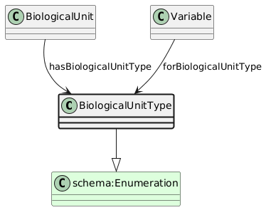

# BiologicalUnitType
[https://schema.plantphenomics.org.au/BiologicalUnitType](https://schema.plantphenomics.org.au/BiologicalUnitType)

A term from an enumeration of types of BiologicalUnit.

## Superclasses
* https://schema.org/Enumeration
## Properties
* [appn:BiologicalUnit](appn_BiologicalUnit.md) **appn:hasBiologicalUnitType** appn:BiologicalUnitType
    * Links a BiologicalUnit to its type.
* [appn:Variable](appn_Variable.md) **appn:forBiologicalUnitType** appn:BiologicalUnitType
    * Links a Variable to the BiologicalUnitType to which it relates.
