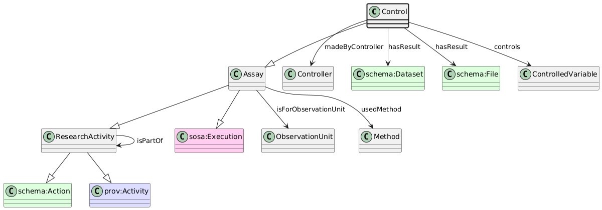

# Control
[https://schema.plantphenomics.org.au/Control](https://schema.plantphenomics.org.au/Control)

An Assay that modifies a property of an ObservationUnit.

## Superclasses
* [https://schema.plantphenomics.org.au/Assay](appn_Assay.md)
* [https://schema.plantphenomics.org.au/ResearchActivity](appn_ResearchActivity.md)
* https://schema.org/Action
* http://www.w3.org/ns/prov#Activity
* https://www.w3.org/ns/sosa/Execution
## Properties
* appn:Control **appn:madeByController** [appn:Controller](appn_Controller.md)
    * Identifies the entity (Controller, i.e. one of a Person, Actuator, SoftwareApplication or ExternalEvent) responsible for carrying out a Control or Treatment.
* appn:Control **appn:hasResult** [schema:Dataset](https://schema.org/Dataset)
    * Identifies a data output from an Observation or Control assay. Individual values are represented by sosa:hasSimpleResult.
* appn:Control **appn:hasResult** [schema:File](https://schema.org/File)
    * Identifies a data output from an Observation or Control assay. Individual values are represented by sosa:hasSimpleResult.
* appn:Control **appn:controls** [appn:ControlledVariable](appn_ControlledVariable.md)
    * Identifies a ControlledVariable controlled by a Control assay. The Control adjusts the state of the ControlledVariable to the value specified in any hasResult or hasSimpleResult property.
* [appn:Assay](appn_Assay.md) **appn:isForObservationUnit** [appn:ObservationUnit](appn_ObservationUnit.md)
    * Relates an Assay to an ObservationUnit for which it is carried out. Note that when the Assay is an Observation, the model should infer a schema:observationAbout property from isForObservationUnit.
* [appn:Assay](appn_Assay.md) **appn:usedMethod** [appn:Method](appn_Method.md)
    * Identifies a Method used to conduct an Assay.
* [appn:ResearchActivity](appn_ResearchActivity.md) **appn:isPartOf** [appn:ResearchActivity](appn_ResearchActivity.md)
    * Relates an Assay to the Study that includes it or a Study to an Investigation.
