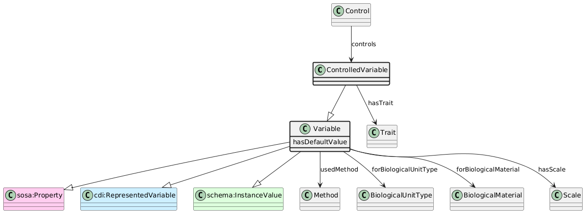

# ControlledVariable
[https://schema.plantphenomics.org.au/ControlledVariable](https://schema.plantphenomics.org.au/ControlledVariable)

A Variable (representation of a Trait using a defined Scale) controlled or modified for an ObservationUnit.

## Superclasses
* [https://schema.plantphenomics.org.au/Variable](appn_Variable.md)
* https://www.w3.org/ns/sosa/Property
* http://ddialliance.org/Specification/DDI-CDI/1.0/RDF/RepresentedVariable
* https://schema.org/InstanceValue
## Properties
* [appn:Control](appn_Control.md) **appn:controls** appn:ControlledVariable
    * Identifies a ControlledVariable controlled by a Control assay. The Control adjusts the state of the ControlledVariable to the value specified in any hasResult or hasSimpleResult property.
* appn:ControlledVariable **appn:hasTrait** [appn:Trait](appn_Trait.md)
    * Identifies the Trait associated with a Variable.
* ControlledVariable https://schema.plantphenomics.org.au/hasDefaultValue
* [appn:Variable](appn_Variable.md) **appn:usedMethod** [appn:Method](appn_Method.md)
    * Identifies a Method used to conduct an Assay.
* [appn:Variable](appn_Variable.md) **appn:forBiologicalUnitType** [appn:BiologicalUnitType](appn_BiologicalUnitType.md)
    * Links a Variable to the BiologicalUnitType to which it relates.
* [appn:Variable](appn_Variable.md) **appn:forBiologicalMaterial** [appn:BiologicalMaterial](appn_BiologicalMaterial.md)
    * Links a Variable to the BiologicalMaterial (i.e. crop) to which it relates.
* [appn:Variable](appn_Variable.md) **appn:hasScale** [appn:Scale](appn_Scale.md)
    * Identifies the Scale associated with a Variable.
