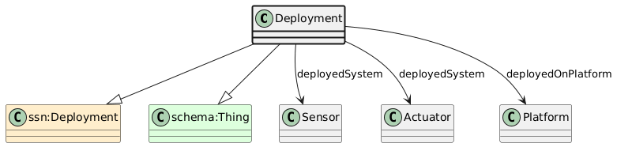

# Deployment
[https://schema.plantphenomics.org.au/Deployment](https://schema.plantphenomics.org.au/Deployment)

A transient or long-term association between a Sensor or Actuator and a Platform on which it is mounted.

## Superclasses
* https://www.w3.org/ns/ssn/Deployment
* https://schema.org/Thing
## Properties
* appn:Deployment **appn:deployedSystem** [appn:Sensor](appn_Sensor.md)
    * Identifies a Sensor or Actuator deployed on a Platform.
* appn:Deployment **appn:deployedSystem** [appn:Actuator](appn_Actuator.md)
    * Identifies a Sensor or Actuator deployed on a Platform.
* appn:Deployment **appn:deployedOnPlatform** [appn:Platform](appn_Platform.md)
    * Identifies a Platform on which Sensors or Actuators are deployed.
