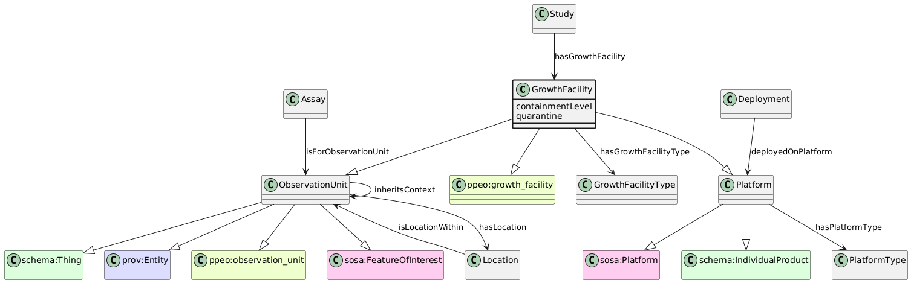

# GrowthFacility
[https://schema.plantphenomics.org.au/GrowthFacility](https://schema.plantphenomics.org.au/GrowthFacility)

A building, enclosed space, field unit, container or other entity in which plants are grown. GrowthFacilities may be nested inside other GrowthFacilities, e.g. rhizoboxes inside a growth chamber, to any depth. GrowthFacilities include all non-biological ObservationUnits and may be defined for each spatial context at which environmental observations are collected or management actions (Treatments) are performed for one or more BiologicalUnits. Where relevant, the position of a GrowthFacility within a larger GrowthFacility can be specified using a Location. GrowthFacilities may be Platforms for Sensors and Actuators.

## Superclasses
* http://purl.org/ppeo/PPEO.owl#growth_facility
* [https://schema.plantphenomics.org.au/Platform](appn_Platform.md)
* https://www.w3.org/ns/sosa/Platform
* https://schema.org/IndividualProduct
* [https://schema.plantphenomics.org.au/ObservationUnit](appn_ObservationUnit.md)
* https://schema.org/Thing
* http://www.w3.org/ns/prov#Entity
* http://purl.org/ppeo/PPEO.owl#observation_unit
* https://www.w3.org/ns/sosa/FeatureOfInterest
## Properties
* appn:GrowthFacility **appn:hasGrowthFacilityType** [appn:GrowthFacilityType](appn_GrowthFacilityType.md)
    * Links a GrowthFacility to its type.
* GrowthFacility https://schema.plantphenomics.org.au/containmentLevel
* GrowthFacility https://schema.plantphenomics.org.au/quarantine
* [appn:Study](appn_Study.md) **appn:hasGrowthFacility** appn:GrowthFacility
    * Identifies a GrowthFacility used in a Study.
* [appn:Platform](appn_Platform.md) **appn:hasPlatformType** [appn:PlatformType](appn_PlatformType.md)
    * Links a Platform to its type.
* [appn:Deployment](appn_Deployment.md) **appn:deployedOnPlatform** [appn:Platform](appn_Platform.md)
    * Identifies a Platform on which Sensors or Actuators are deployed.
* [appn:Assay](appn_Assay.md) **appn:isForObservationUnit** [appn:ObservationUnit](appn_ObservationUnit.md)
    * Relates an Assay to an ObservationUnit for which it is carried out. Note that when the Assay is an Observation, the model should infer a schema:observationAbout property from isForObservationUnit.
* [appn:ObservationUnit](appn_ObservationUnit.md) **appn:inheritsContext** [appn:ObservationUnit](appn_ObservationUnit.md)
    * Indicates an ObservationUnit should be considered to inherit values for Variables from another ObservationUnit. Examples include a plant inheriting environmental variables from a pot, growth cabinet or field or a leaf inheriting environmental and developmental properties from a plant.
* [appn:ObservationUnit](appn_ObservationUnit.md) **appn:hasLocation** [appn:Location](appn_Location.md)
    * Specifies the location for an ObservationUnit.
* [appn:Location](appn_Location.md) **appn:isLocationWithin** [appn:ObservationUnit](appn_ObservationUnit.md)
    * Specifies that a location is a position within an ObservationUnit.
