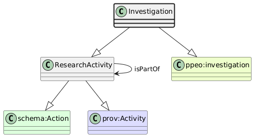

# Investigation
[https://schema.plantphenomics.org.au/Investigation](https://schema.plantphenomics.org.au/Investigation)

A research programme including one or more Studies.

## Superclasses
* [https://schema.plantphenomics.org.au/ResearchActivity](appn_ResearchActivity.md)
* https://schema.org/Action
* http://www.w3.org/ns/prov#Activity
* http://purl.org/ppeo/PPEO.owl#investigation
## Properties
* [appn:ResearchActivity](appn_ResearchActivity.md) **appn:isPartOf** [appn:ResearchActivity](appn_ResearchActivity.md)
    * Relates an Assay to the Study that includes it or a Study to an Investigation.
