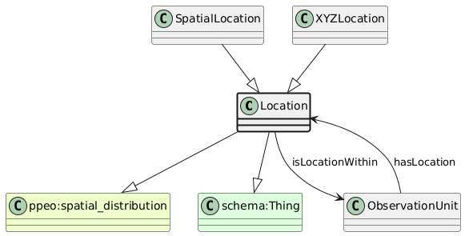

# Location
[https://schema.plantphenomics.org.au/Location](https://schema.plantphenomics.org.au/Location)

A position associated with the placement of a GrowthFacility within another GrowthFacility or of a BiologicalUnit within another BiologicalUnit or GrowthFacility. Position may be expressed as absolute geospatial coordinates (SpatialLocation) or using a locally appropriate organisation into rows and columns and optionally levels (XYZLocation).

## Superclasses
* http://purl.org/ppeo/PPEO.owl#spatial_distribution
* http://schema.org/Thing
## Properties
* appn:Location **appn:isLocationFor** [appn:ObservationUnit](appn_ObservationUnit.md)
    * Specifies the ObservationUnit to which a Location relates.
* appn:Location **appn:isLocationWithin** [appn:ObservationUnit](appn_ObservationUnit.md)
    * Specifies that a Location is a position within an ObservationUnit.
* appn:Location **appn:hasLocationSchema** [appn:LocationSchema](appn_LocationSchema.md)
    * Specifies the schema defining the levels in describing a Location.
* appn:Location **appn:schemaLevel1** [xsd:string](http://www.w3.org/2001/XMLSchema#string)
    * Specifies the most signicant level of organisation when specifying a location.
* appn:Location **appn:schemaLevel1** [xsd:integer](http://www.w3.org/2001/XMLSchema#integer)
    * Specifies the most signicant level of organisation when specifying a location.
* appn:Location **appn:schemaLevel1** [xsd:decimal](http://www.w3.org/2001/XMLSchema#decimal)
    * Specifies the most signicant level of organisation when specifying a location.
* appn:Location **appn:schemaLevel2** [xsd:string](http://www.w3.org/2001/XMLSchema#string)
    * Specifies the second most signicant level of organisation when specifying a location.
* appn:Location **appn:schemaLevel2** [xsd:integer](http://www.w3.org/2001/XMLSchema#integer)
    * Specifies the second most signicant level of organisation when specifying a location.
* appn:Location **appn:schemaLevel2** [xsd:decimal](http://www.w3.org/2001/XMLSchema#decimal)
    * Specifies the second most signicant level of organisation when specifying a location.
* appn:Location **appn:schemaLevel3** [xsd:string](http://www.w3.org/2001/XMLSchema#string)
    * Specifies the third most signicant level of organisation when specifying a location.
* appn:Location **appn:schemaLevel3** [xsd:integer](http://www.w3.org/2001/XMLSchema#integer)
    * Specifies the third most signicant level of organisation when specifying a location.
* appn:Location **appn:schemaLevel3** [xsd:decimal](http://www.w3.org/2001/XMLSchema#decimal)
    * Specifies the third most signicant level of organisation when specifying a location.
* appn:Location **appn:schemaLevel4** [xsd:string](http://www.w3.org/2001/XMLSchema#string)
    * Specifies the fourth most signicant level of organisation when specifying a location.
* appn:Location **appn:schemaLevel4** [xsd:integer](http://www.w3.org/2001/XMLSchema#integer)
    * Specifies the fourth most signicant level of organisation when specifying a location.
* appn:Location **appn:schemaLevel4** [xsd:decimal](http://www.w3.org/2001/XMLSchema#decimal)
    * Specifies the fourth most signicant level of organisation when specifying a location.
* appn:Location **appn:schemaLevel5** [xsd:string](http://www.w3.org/2001/XMLSchema#string)
    * Specifies the fifth most signicant level of organisation when specifying a location.
* appn:Location **appn:schemaLevel5** [xsd:integer](http://www.w3.org/2001/XMLSchema#integer)
    * Specifies the fifth most signicant level of organisation when specifying a location.
* appn:Location **appn:schemaLevel5** [xsd:decimal](http://www.w3.org/2001/XMLSchema#decimal)
    * Specifies the fifth most signicant level of organisation when specifying a location.
* appn:Location **appn:schemaLevel6** [xsd:string](http://www.w3.org/2001/XMLSchema#string)
    * Specifies the sixth most signicant level of organisation when specifying a location.
* appn:Location **appn:schemaLevel6** [xsd:integer](http://www.w3.org/2001/XMLSchema#integer)
    * Specifies the sixth most signicant level of organisation when specifying a location.
* appn:Location **appn:schemaLevel6** [xsd:decimal](http://www.w3.org/2001/XMLSchema#decimal)
    * Specifies the sixth most signicant level of organisation when specifying a location.
* appn:Location **appn:schemaLevel7** [xsd:string](http://www.w3.org/2001/XMLSchema#string)
    * Specifies the seventh most signicant level of organisation when specifying a location.
* appn:Location **appn:schemaLevel7** [xsd:integer](http://www.w3.org/2001/XMLSchema#integer)
    * Specifies the seventh most signicant level of organisation when specifying a location.
* appn:Location **appn:schemaLevel7** [xsd:decimal](http://www.w3.org/2001/XMLSchema#decimal)
    * Specifies the seventh most signicant level of organisation when specifying a location.
* appn:Location **appn:schemaLevel8** [xsd:string](http://www.w3.org/2001/XMLSchema#string)
    * Specifies the eighth most signicant level of organisation when specifying a location.
* appn:Location **appn:schemaLevel8** [xsd:integer](http://www.w3.org/2001/XMLSchema#integer)
    * Specifies the eighth most signicant level of organisation when specifying a location.
* appn:Location **appn:schemaLevel8** [xsd:decimal](http://www.w3.org/2001/XMLSchema#decimal)
    * Specifies the eighth most signicant level of organisation when specifying a location.
* appn:Location **appn:startTime** [xsd:dateTime](http://www.w3.org/2001/XMLSchema#dateTime)
    * The time at which a ResearchActivity started
* appn:Location **appn:endTime** [xsd:dateTime](http://www.w3.org/2001/XMLSchema#dateTime)
    * The time at which a ResearchActivity ended
* appn:Location **appn:atTime** [xsd:dateTime](http://www.w3.org/2001/XMLSchema#dateTime)
    * The time at which a ResearchActivity occurred - equivalent to both startTime and endTime
## Subclasses
* [https://schema.plantphenomics.org.au/SpatialLocation](appn_SpatialLocation.md)
* [https://schema.plantphenomics.org.au/XYZLocation](appn_XYZLocation.md)
