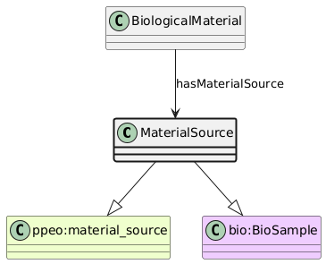

# MaterialSource
[https://schema.plantphenomics.org.au/MaterialSource](https://schema.plantphenomics.org.au/MaterialSource)

The source for the BiologicalMaterial.

## Superclasses
* http://purl.org/ppeo/PPEO.owl#material_source
* https://bioschemas.org/BioSample
## Properties
* [appn:BiologicalMaterial](appn_BiologicalMaterial.md) **appn:hasMaterialSource** appn:MaterialSource
    * Identifies the MaterialSource for BiologicalMaterial.
