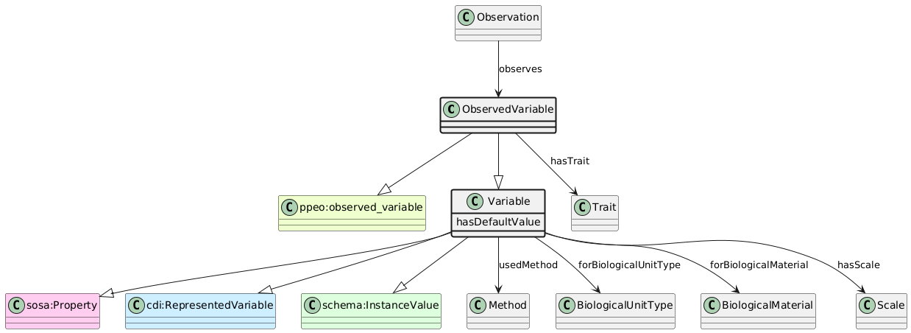

# ObservedVariable
[https://schema.plantphenomics.org.au/ObservedVariable](https://schema.plantphenomics.org.au/ObservedVariable)

A Variable (representation of a Trait using a defined Scale) observed or measured for an ObservationUnit.

## Superclasses
* http://purl.org/ppeo/PPEO.owl#observed_variable
* [https://schema.plantphenomics.org.au/Variable](appn_Variable.md)
* https://www.w3.org/ns/sosa/Property
* http://ddialliance.org/Specification/DDI-CDI/1.0/RDF/RepresentedVariable
* https://schema.org/InstanceValue
## Properties
* [appn:Observation](appn_Observation.md) **appn:observes** appn:ObservedVariable
    * Identifies an ObservedVariable controlled by an Observation assay. The Observation records or estimates the state of the ObservationVariable recorded as a value specified in a hasResult or hasSimpleResult property.
* appn:ObservedVariable **appn:hasTrait** [appn:Trait](appn_Trait.md)
    * Identifies the Trait associated with a Variable.
* ObservedVariable https://schema.plantphenomics.org.au/hasDefaultValue
* [appn:Variable](appn_Variable.md) **appn:usedMethod** [appn:Method](appn_Method.md)
    * Identifies a Method used to conduct an Assay.
* [appn:Variable](appn_Variable.md) **appn:forBiologicalUnitType** [appn:BiologicalUnitType](appn_BiologicalUnitType.md)
    * Links a Variable to the BiologicalUnitType to which it relates.
* [appn:Variable](appn_Variable.md) **appn:forBiologicalMaterial** [appn:BiologicalMaterial](appn_BiologicalMaterial.md)
    * Links a Variable to the BiologicalMaterial (i.e. crop) to which it relates.
* [appn:Variable](appn_Variable.md) **appn:hasScale** [appn:Scale](appn_Scale.md)
    * Identifies the Scale associated with a Variable.
