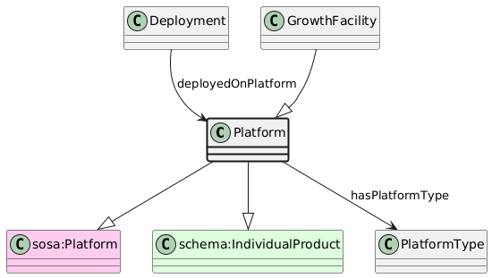

# Platform
[https://schema.plantphenomics.org.au/Platform](https://schema.plantphenomics.org.au/Platform)

A vehicle, building, person or other entity that may carry or include Sensors or Actuators.

## Superclasses
* https://www.w3.org/ns/sosa/Platform
* https://schema.org/IndividualProduct
## Properties
* [appn:Deployment](appn_Deployment.md) **appn:deployedOnPlatform** appn:Platform
    * Identifies a Platform on which Sensors or Actuators are deployed.
## Subclasses
* [https://schema.plantphenomics.org.au/GrowthFacility](appn_GrowthFacility.md)
