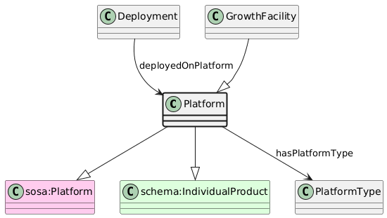

# Platform
[https://schema.plantphenomics.org.au/Platform](https://schema.plantphenomics.org.au/Platform)

A vehicle, building, person or other entity that may carry or include Sensors or Actuators. A Platform is also an ObservationUnit so that it may be the target for Observation Assays (reading device state as ObservedVariables) and potentially for Control Assays (setting parameters as ControlledVariables).

## Superclasses
* http://www.w3.org/ns/sosa/Platform
* [https://schema.plantphenomics.org.au/ObservationUnit](appn_ObservationUnit.md)
* http://schema.org/Thing
* http://www.w3.org/ns/prov#Entity
* http://purl.org/ppeo/PPEO.owl#observation_unit
* http://www.w3.org/ns/sosa/FeatureOfInterest
* http://schema.org/IndividualProduct
## Properties
* appn:Platform **appn:hasPlatformType** [appn:PlatformType](appn_PlatformType.md)
    * Links a Platform to its type.
* appn:Platform **appn:hosts** [appn:Sensor](appn_Sensor.md)
    * Identifies a Sensor or Actuator hosted by a Platform.
* appn:Platform **appn:hosts** [appn:Actuator](appn_Actuator.md)
    * Identifies a Sensor or Actuator hosted by a Platform.
* [appn:Deployment](appn_Deployment.md) **appn:deployedOnPlatform** appn:Platform
    * Identifies a Platform on which Sensors or Actuators are deployed.
* [appn:Assay](appn_Assay.md) **appn:isForObservationUnit** [appn:ObservationUnit](appn_ObservationUnit.md)
    * Relates an Assay to an ObservationUnit for which it is carried out. Note that when the Assay is an Observation, the model should infer a schema:observationAbout property from isForObservationUnit.
* [appn:ObservationUnit](appn_ObservationUnit.md) **appn:inheritsContext** [appn:ObservationUnit](appn_ObservationUnit.md)
    * Indicates an ObservationUnit should be considered to inherit values for Variables from another ObservationUnit. Examples include a plant inheriting environmental variables from a pot, growth cabinet or field or a leaf inheriting environmental and developmental properties from a plant.
* [appn:ObservationUnit](appn_ObservationUnit.md) **appn:hasLocation** [appn:Location](appn_Location.md)
    * Specifies the location for an ObservationUnit.
* [appn:Location](appn_Location.md) **appn:isLocationWithin** [appn:ObservationUnit](appn_ObservationUnit.md)
    * Specifies that a location is a position within an ObservationUnit.
## Subclasses
* [https://schema.plantphenomics.org.au/GrowthFacility](appn_GrowthFacility.md)
