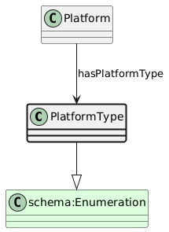

# PlatformType
[https://schema.plantphenomics.org.au/PlatformType](https://schema.plantphenomics.org.au/PlatformType)

A term from an enumeration of types of Platform.

## Superclasses
* https://schema.org/Enumeration
## Properties
* [appn:Platform](appn_Platform.md) **appn:hasPlatformType** appn:PlatformType
    * Links a Platform to its type.
