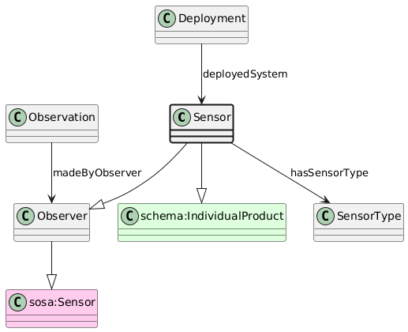

# Sensor
[https://schema.plantphenomics.org.au/Sensor](https://schema.plantphenomics.org.au/Sensor)

An electromechanical device that can return the value for an ObservedVariable and that may be mounted on a Platform. Note that SOSA maps electromechanical components to prov:Agent, but CDIF recommendation is that Agent should be an intentional role. A Sensor is also an ObservationUnit so that it may be the target for Control Assays (setting device parameters as ControlledVariables) and potentially for Observation Assays (reading device state as ObservedVariables).

## Superclasses
* [https://schema.plantphenomics.org.au/Observer](appn_Observer.md)
* https://www.w3.org/ns/sosa/Sensor
* [https://schema.plantphenomics.org.au/ObservationUnit](appn_ObservationUnit.md)
* https://schema.org/Thing
* http://www.w3.org/ns/prov#Entity
* http://purl.org/ppeo/PPEO.owl#observation_unit
* https://www.w3.org/ns/sosa/FeatureOfInterest
* https://schema.org/IndividualProduct
## Properties
* appn:Sensor **appn:hasSensorType** [appn:SensorType](appn_SensorType.md)
    * Links a Sensor to its type.
* [appn:Deployment](appn_Deployment.md) **appn:deployedSystem** appn:Sensor
    * Identifies a Sensor or Actuator deployed on a Platform.
* [appn:Observation](appn_Observation.md) **appn:madeByObserver** [appn:Observer](appn_Observer.md)
    * Identifies the entity (Observer, i.e. one of a Person, Sensor or SoftwareApplication) responsible for carrying out an Observation.
* [appn:Assay](appn_Assay.md) **appn:isForObservationUnit** [appn:ObservationUnit](appn_ObservationUnit.md)
    * Relates an Assay to an ObservationUnit for which it is carried out. Note that when the Assay is an Observation, the model should infer a schema:observationAbout property from isForObservationUnit.
* [appn:ObservationUnit](appn_ObservationUnit.md) **appn:inheritsContext** [appn:ObservationUnit](appn_ObservationUnit.md)
    * Indicates an ObservationUnit should be considered to inherit values for Variables from another ObservationUnit. Examples include a plant inheriting environmental variables from a pot, growth cabinet or field or a leaf inheriting environmental and developmental properties from a plant.
* [appn:ObservationUnit](appn_ObservationUnit.md) **appn:hasLocation** [appn:Location](appn_Location.md)
    * Specifies the location for an ObservationUnit.
* [appn:Location](appn_Location.md) **appn:isLocationWithin** [appn:ObservationUnit](appn_ObservationUnit.md)
    * Specifies that a location is a position within an ObservationUnit.
