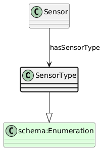

# SensorType
[https://schema.plantphenomics.org.au/SensorType](https://schema.plantphenomics.org.au/SensorType)

A term from an enumeration of types of Sensor.

## Superclasses
* https://schema.org/Enumeration
## Properties
* [appn:Sensor](appn_Sensor.md) **appn:hasSensorType** appn:SensorType
    * Links a Sensor to its type.
