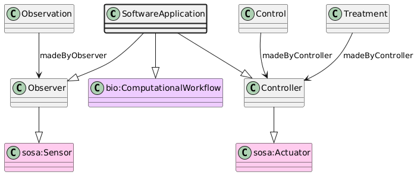

# SoftwareApplication
[https://schema.plantphenomics.org.au/SoftwareApplication](https://schema.plantphenomics.org.au/SoftwareApplication)

A piece of software that may be perform an Assay. Note that SOSA maps software components to prov:Agent, but CDIF recommendation is that Agent should be an intentional role.

## Superclasses
* https://bioschemas.org/ComputationalWorkflow
* [https://schema.plantphenomics.org.au/Observer](appn_Observer.md)
* https://www.w3.org/ns/sosa/Sensor
* [https://schema.plantphenomics.org.au/Controller](appn_Controller.md)
* https://www.w3.org/ns/sosa/Actuator
## Properties
* [appn:Observation](appn_Observation.md) **appn:madeByObserver** [appn:Observer](appn_Observer.md)
    * Identifies the entity (Observer, i.e. one of a Person, Sensor or SoftwareApplication) responsible for carrying out an Observation.
* [appn:Control](appn_Control.md) **appn:madeByController** [appn:Controller](appn_Controller.md)
    * Identifies the entity (Controller, i.e. one of a Person, Actuator, SoftwareApplication or ExternalEvent) responsible for carrying out a Control or Treatment.
* [appn:Treatment](appn_Treatment.md) **appn:madeByController** [appn:Controller](appn_Controller.md)
    * Identifies the entity (Controller, i.e. one of a Person, Actuator, SoftwareApplication or ExternalEvent) responsible for carrying out a Control or Treatment.
