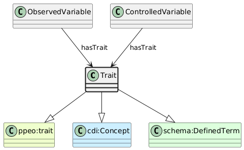

# Trait
[https://schema.plantphenomics.org.au/Trait](https://schema.plantphenomics.org.au/Trait)

A concept represented by a Variable associated with an ObservationUnit. In the DDI-CDI Variable Cascade, a Trait is a Concept or ConceptualVariable.

## Superclasses
* http://purl.org/ppeo/PPEO.owl#trait
* http://ddialliance.org/Specification/DDI-CDI/1.0/RDF/Concept
* http://schema.org/DefinedTerm
## Properties
* [appn:ObservedVariable](appn_ObservedVariable.md) **appn:hasTrait** appn:Trait
    * Identifies the Trait associated with a Variable.
* [appn:ControlledVariable](appn_ControlledVariable.md) **appn:hasTrait** appn:Trait
    * Identifies the Trait associated with a Variable.
## Subclasses
* [https://schema.plantphenomics.org.au/Variable](appn_Variable.md)
* [https://schema.plantphenomics.org.au/ObservedVariable](appn_ObservedVariable.md)
* [https://schema.plantphenomics.org.au/ControlledVariable](appn_ControlledVariable.md)
* [https://schema.plantphenomics.org.au/SubstanceQuantity](appn_SubstanceQuantity.md)
