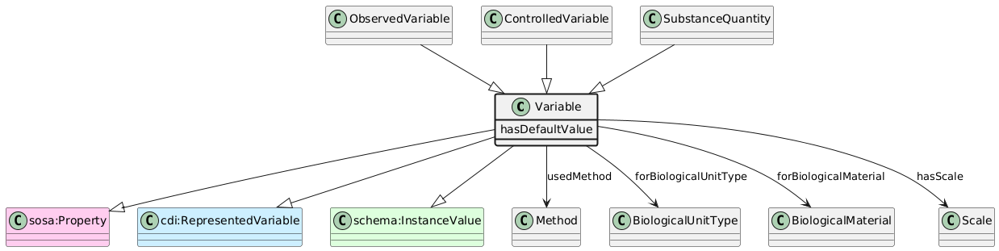

# Variable
[https://schema.plantphenomics.org.au/Variable](https://schema.plantphenomics.org.au/Variable)

Representation of a Trait using a defined Scale. In the DDI-CDI Variable Cascade, a Variable is a RepresentedVariable or an InstanceVariable.

## Superclasses
* [https://schema.plantphenomics.org.au/Trait](appn_Trait.md)
* http://purl.org/ppeo/PPEO.owl#trait
* http://ddialliance.org/Specification/DDI-CDI/1.0/RDF/Concept
* https://schema.org/DefinedTerm
* http://www.w3.org/ns/sosa/Property
* http://ddialliance.org/Specification/DDI-CDI/1.0/RDF/RepresentedVariable
* https://schema.org/InstanceValue
## Properties
* Variable https://schema.plantphenomics.org.au/hasDefaultValue
* appn:Variable **appn:usedMethod** [appn:Method](appn_Method.md)
    * Identifies a Method used to conduct an Assay.
* appn:Variable **appn:forBiologicalUnitType** [appn:BiologicalUnitType](appn_BiologicalUnitType.md)
    * Links a Variable to the BiologicalUnitType to which it relates.
* appn:Variable **appn:forBiologicalMaterial** [appn:BiologicalMaterial](appn_BiologicalMaterial.md)
    * Links a Variable to the BiologicalMaterial (i.e. crop) to which it relates.
* appn:Variable **appn:hasScale** [appn:Scale](appn_Scale.md)
    * Identifies the Scale associated with a Variable.
* [appn:ObservedVariable](appn_ObservedVariable.md) **appn:hasTrait** [appn:Trait](appn_Trait.md)
    * Identifies the Trait associated with a Variable.
* [appn:ControlledVariable](appn_ControlledVariable.md) **appn:hasTrait** [appn:Trait](appn_Trait.md)
    * Identifies the Trait associated with a Variable.
## Subclasses
* [https://schema.plantphenomics.org.au/ObservedVariable](appn_ObservedVariable.md)
* [https://schema.plantphenomics.org.au/ControlledVariable](appn_ControlledVariable.md)
* [https://schema.plantphenomics.org.au/SubstanceQuantity](appn_SubstanceQuantity.md)
