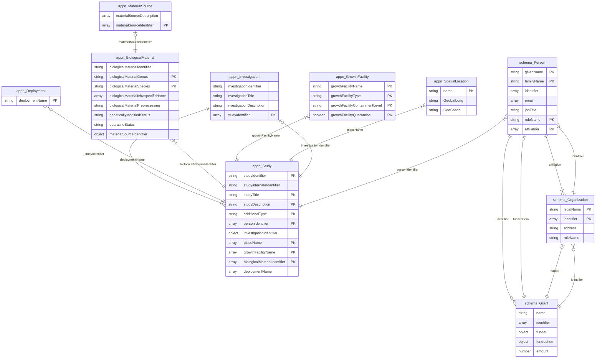
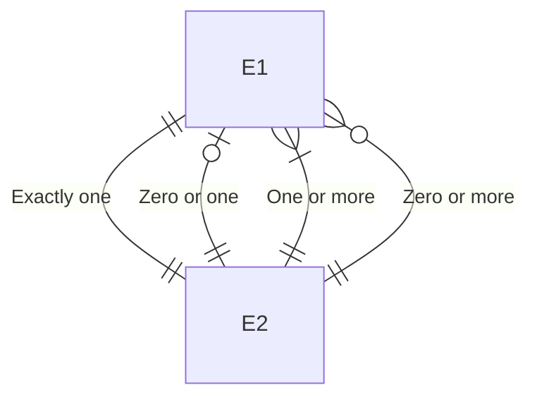

### Scripts used to convert Excel schema definitions to ER diagrams

These scripts help with the semi-automated production of the ER diagram from the booking sheet fields that are defined in:
  
  [APPN Booking sheet metadata mapping 2026 RDv1](https://uao365.sharepoint.com/:x:/r/sites/APPF2023-28/Shared%20Documents/Coordinating%20Data%20Collection/Central%20Team%20Notes/APPN%20Booking%20sheet%20metadata%20mapping%202026%20RDv1.xlsx?d=wbbb765a5bc6e44cdb1150648d866ad58&csf=1&web=1&e=3hz8bC)
  

The above spreadsheet was copied and then extended as filename named ```appn_schema_tabdelim_appn_hand_edited.txt```. This file has extra columns and the relationships between classes are added to each class definition. 

The edited file will be the input file to the following script (hand modified to add the filename ```appn_schema_tabdelim_appn_hand_edited.txt``` - 

```python
python convert_booking_def_to_jsonschema.py

```

The above script outputs a Python library```jsonschema``` file named  ```appn_schema_tabdelim_appn.json```

The schema file is then reprocessed to output a Mermaid ER diagram

```python
python generate_mermaide_from_schema.py appn_schema_tabdelim_appn_hand_edited.json
```

The current output generates something like the following:
  


  
With some definitions of relationship types - 
  


<ul>
  <li><strong>PK</strong> = Primary Key</li>
  <li><strong>FK</strong> = Foreign Key</li>
</ul>
  
> N.B. The foreign key designation is not automated from the generator script and the primary key field is currently a temporary placeholder.